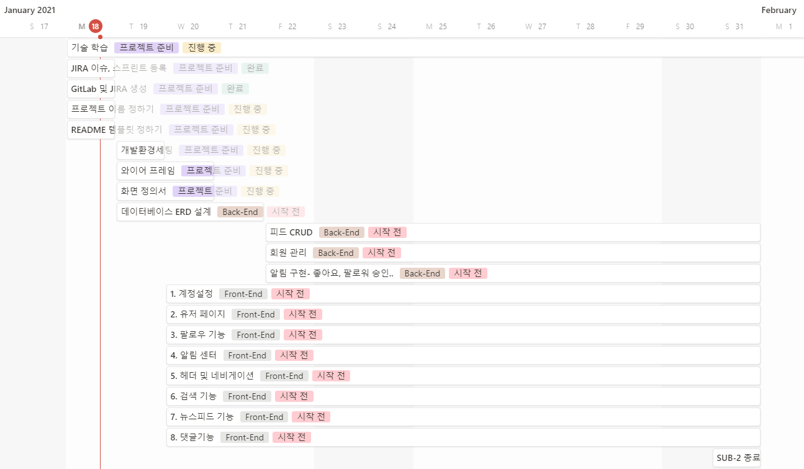

# 목차

- [🐶 팀명 (Pet Story)](#-------pet-story-)
- [1. 프로젝트 개요](#1--------)
  * [1. 주제](#1---)
  * [2. 기술 스택](#2------)
  * [3. 계획 (Gantt chart)](#3-----gantt-chart-)
- [2. 개발 규칙](#2------)
  * [Git](#git)
    + [Commit Message 규약](#commit-message---)
      - [Git Message Template](#git-message-template)
      - [Commit Message Naming](#commit-message-naming)
    + [Git Flow 규약](#git-flow---)
      - [Branch Naming](#branch-naming)
      - [Merge 규칙](#merge---)
      - [HOW TO](#how-to)
        * [1. Branch Fork하기](#1-branch-fork--)
        * [2. Branch 작업하기](#2-branch-----)
        * [3. Branch 머지하기](#3-branch-----)
        * [Option (작업 중 최신화)](#option-----------)


#  🐶 팀명 (Pet Story)

- 팀원
  - 팀장 : 황영준
  - 팀원 : 류건희, 유진우, 신민호, 전의수, 김문정

<br>

# 1. 프로젝트 개요

## 1. 주제

- WHY

  > 반려동물 가정이 증가하고 있다. 
  >
  > 그에 따라 반려동물 관련 정보 수요가 증가하는 데 비해, 
  >
  >  지역 내 반려동물을 위한 커뮤니티의 수가 적거나 진입 장벽이 높아서 참여가 힘들다.
  >
  > 같은 지역 내에서, 쉽고 편하게 참가할 수 있는 **반려 동물 커뮤니티가 필요**하다.

- HOW

  > SNS를 통해 같은 관심사를 가진 사람들이 모여서 정보를 교환한다.
  >
  > 동물의 입장에서 SNS 게시글을 작성함으로써, 재미를 제공하여 기존 유저의 유지와 새로운 유저의 유입을 활성화한다.

- WHAT

  > 반려동물을 키우는 사람들의 커뮤니티

<br>

## 2. 기술 스택  

- FE: REACT
- BE : Spring, MySQL

<br>

## 3. 계획 (Gantt chart)



<br>

<br>

# 2. 개발 규칙

## Git

### Commit Message 규약

- #### Git Message Template

  ```bash
  S04P12B204- [feat] : /FE
  # 이슈 번호 [속성] : 내용 /FE 또는 /BE
  ##### 제목은 최대 50 글자까지만 입력 ############## -> |
  -> S04P12B204-90 [feat] : 로그인 기능 /FE
  
  ######## 본문은 한 줄에 최대 72 글자까지만 입력 ########################### -> |
  -> 로그인 시 썸네일 선택해서 해당 프로필로 로그인
  
  #   속성 분류
  #   feat       : 새로운 기능 추가
  #   fix        : 버그 수정
  #   refactor   : 코드 리팩토링
  #   style      : 코드 포맷팅, 세미콜론 누락, 코드 변경이 없는 경우
  #   docs       : 문서 수정
  #   test       : 테스트 코드, 리팩토링 테스트 코드 추가
  #   chore      : 빌드 업무 수정, 패키지 매니저 수정
  # ------------------
  #     제목 첫 글자를 대문자로
  #     제목은 명령문으로
  #     제목 끝에 마침표(.) 금지
  #     제목과 본문을 한 줄 띄워 분리하기
  #     본문은 "어떻게" 보다 "무엇을", "왜"를 설명한다.
  #     본문에 여러줄의 메시지를 작성할 땐 "-"로 구분
  # ------------------
  ```

  - 저장 시 ^M 오류 해결

    1. 적용할 파일을 vim 으로 열기

    2. 명령 모드에서 아래의 명령어 입력

       ```
       :set ff=unix
       ```

       CRLF 값을 LF로 바꿔주며, 이후에 작성한 결과도 LF 값으로 작성이 된다.

  - 템플릿 활용한 깃 메세지 예시

    

<br>

- #### Commit Message Naming

  >  이슈 번호 [속성] : 내용 /FE 또는 /BE

  예시)

  > S04P12B204-90 [feat] : 로그인 기능 /FE

### Git Flow 규약

참고 : 

[우아한]: https://woowabros.github.io/experience/2017/10/30/baemin-mobile-git-branch-strategy.html	"우아한 형제들 기술 블로그"

참고 : https://woowabros.github.io/experience/2017/10/30/baemin-mobile-git-branch-strategy.html

#### Branch Naming

- `Backend` : **master → develop → feature(JIRA에픽 name) → JIRA이슈번호_BE**

- `Frontend` : **master → develop → feature(JIRA에픽 name) → JIRA이슈번호_FE**

  - master : 제품으로 출시될 수 있는 브랜치

  - develop : 다음 출시 버전을 개발하는 브랜치

    ```
               (기능이 완성되면 feature를 develop에 merge 시킴)
    ```

  - feature : 기능을 개발하는 브랜치(JIRA 에픽 네임으로 설정 ex)Login)

    ```
               (JIRA 이슈가 해결되면 이슈를 feature에 merge시킴)
    ```

  - JIRA-BE : JIRA에 등록된 이슈 대로 브랜치를 만들어 기능을 만듦

    <br>

#### Merge 규칙

- 작업을 시작하기 전에 **JIRA 이슈를 생성**한다.
  - 이슈는 되도록 하나의 커밋으로 한다.
- 커밋 그래프는 최대한 단순하게 한다.
- 서로 공유하는 브랜치의 커밋 그래프는 함부로 변경하지 않는다.
- **merge 를 하기 전** 적어도 1명의 팀원에게 **코드 리뷰** 후 merge를 시킴
- 자신의 Pull Request는 스스로 merge를 한다.

<br>

#### HOW TO 

##### 1. Branch Fork하기

1. 프로젝트(upstream)에서 fork를 떠서 나의 레포(origin)를 생성한다

2. 나의 레포(origin)에서 나의 컴퓨터(local)에 git clone 을 받는다

3. 로컬에서 upstream을 추가해준다.

   > $ git remote add upstream https://lab.ssafy.com/s04-webmobile2-sub2/s04p12b204.git

   > $ git remote [-](https://lab.ssafy.com/s04-webmobile2-sub2/s04p12b204.git)v 로 확인

   

4. 로컬에서 upstream/feature 아래에 지라이슈번호 브랜치를 생성하고 이동한다.

   (track은 upstream/feature를 추적한다.)

   > $ git checkout -b 지라이슈번호--track upstream/feature

<br>

##### 2. Branch 작업하기

1. 해당 브랜치에서 해당 내용을 작업하고 add 한다

   > $ git add .

2. commit 한다(양식에 맞춰서)

   > $ git commit -m “이슈번호 feat : 로그인 기능 추가/BE”

3. 필요하면 rebase로 커밋을 줄인다 아래는 2개 합친 것

   > $ git rebase -i HEAD~2

4. fetch로 최신화 시켜준다

   > $ git fetch --all 로 local을 최신화 시켜준다

5. upstream레포의 해당 브랜치의 최신 작업 내용을 땡겨서 rebase한다.

   > $ git pull --rebase upstream feature

6. origin레포로 push 한다.

   > $ git push origin 작업브랜치

<br>

##### 3. Branch 머지하기

1. Fork뜬 나의 origin 브랜치를 upstream 브랜치에 merge하는 Pull Request를 생성합니다.

2. 같은 feature를 개발하는 동료에게 리뷰 승인을 받은 후 자신의 Pull Request를 merge합니다. 

   만약 혼자 feature를 개발한다면 1~2명의 동료에게 리뷰 승인을 받은 후, Pull Request를 merge합니다.

<br>

##### Option (작업 중 최신화)

