[TOC]


#  🐶 팀명 (Pet Story)

| 이름   | 직책 | 역할                 |
| ------ | ---- | -------------------- |
| 황영준 | 팀장 | Backend, 팀장        |
| 류건희 | 팀원 | Backend, 테크리더    |
| 유진우 | 팀원 | Frontend, 테크리더   |
| 신민호 | 팀원 | Frontend, 기획       |
| 전의수 | 팀원 | Frontend, Git master |
| 김문정 | 팀원 | Frontend, QA         |

<br>

# 프로젝트 개요

- **진행 기간** : 2021.01.11 ~ 2021.02.19


## 1. 주제

- WHY

    ```
    - 반려동물 가정이 증가하고 있다. 
    - 그에 따라 반려동물 관련 정보 수요가 증가하는 데 비해, 
    - 지역 내 반려동물을 위한 커뮤니티의 수가 적거나 진입 장벽이 높아서 참여가 힘들다.
    - 같은 지역 내에서, 쉽고 편하게 참가할 수 있는 **반려 동물 커뮤니티가 필요하다.
    ```


- HOW

  ```
  - SNS를 통해 같은 관심사를 가진 사람들이 모여서 정보를 교환한다.
  - 동물의 입장에서 SNS 게시글을 작성함으로써, 
  - 재미를 제공하여 기존 유저의 유지와 새로운 유저의 유입을 활성화한다.
  ```

  

- WHAT

  ```
  - 반려동물을 위한 커뮤니티
  ```
  


## 2. 기획배경

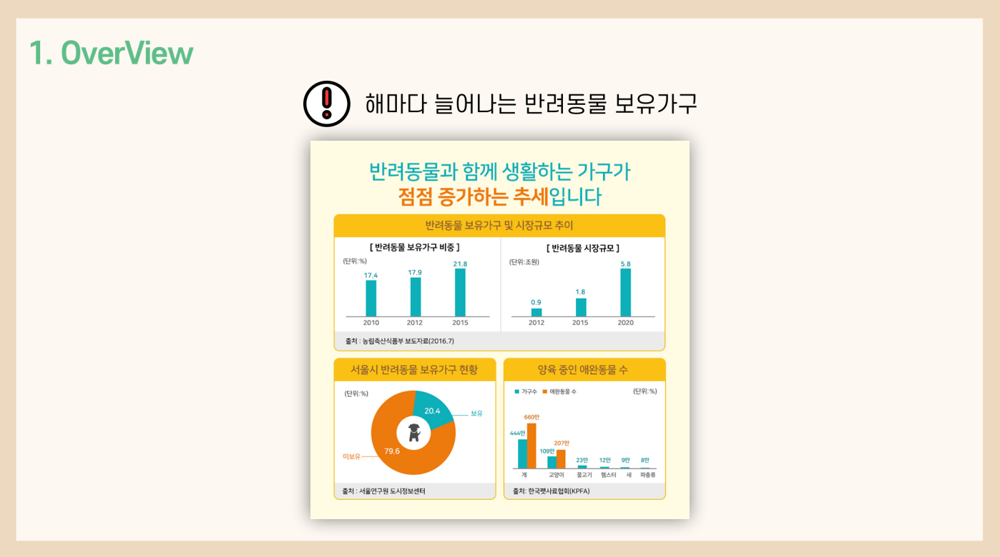

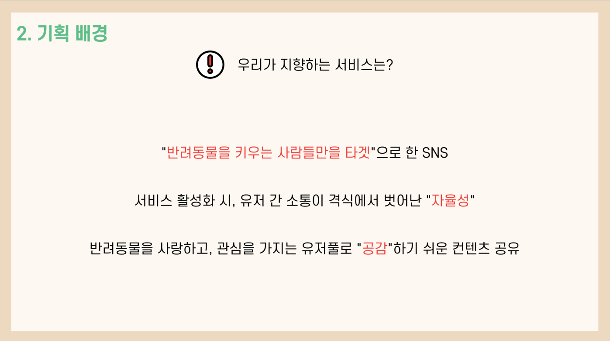

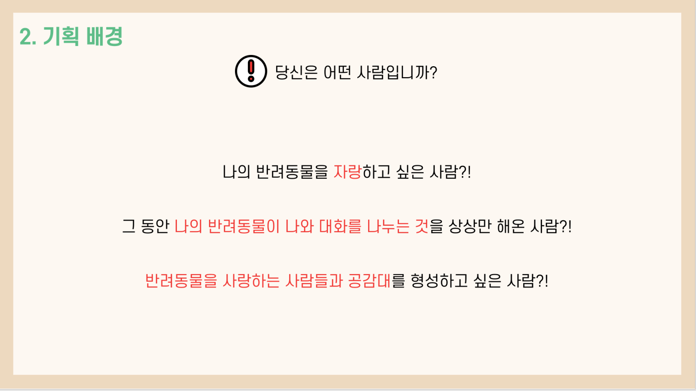


## 3. 기술 스택  

- FE:  REACT, node.js
- BE : Spring boot(JPA), MySQL
- DevOps: GitLab,  Jenkins, Docker, JIRA, AWS


## 4. 계획 (Gantt chart)

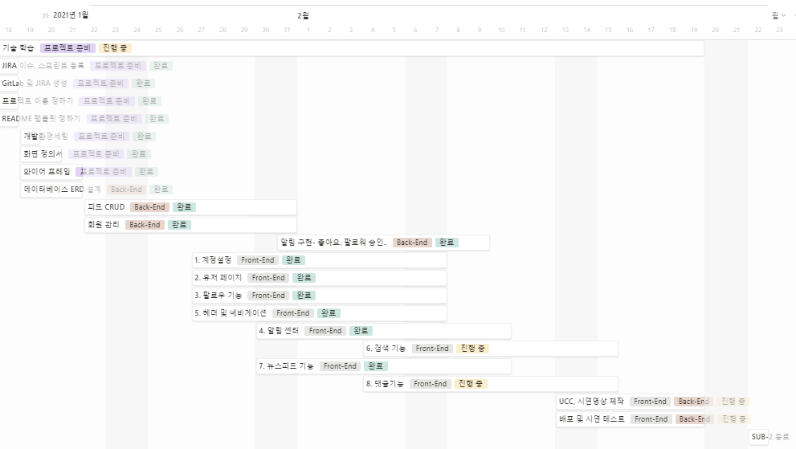


## 5. ERD

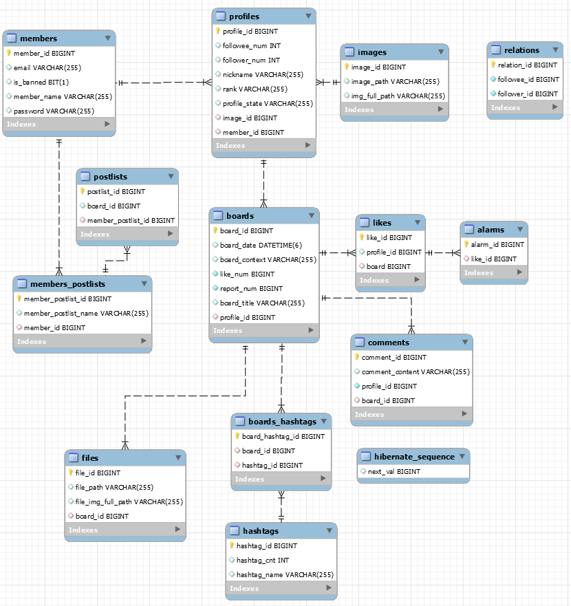


## 6. 주요기능

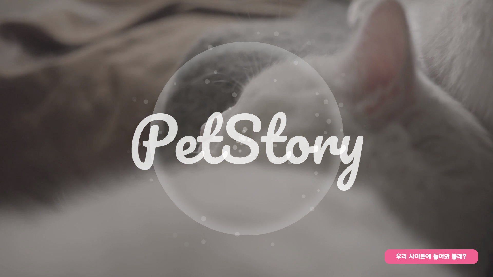

시작 페이지

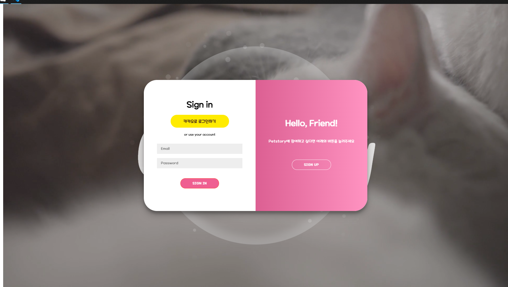

로그인 페이지 + 카카오 로그인

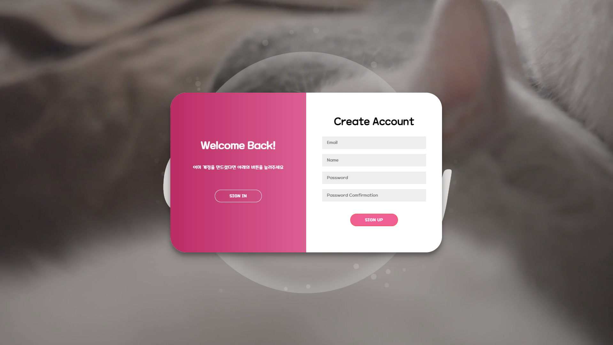

 회원가입 페이지

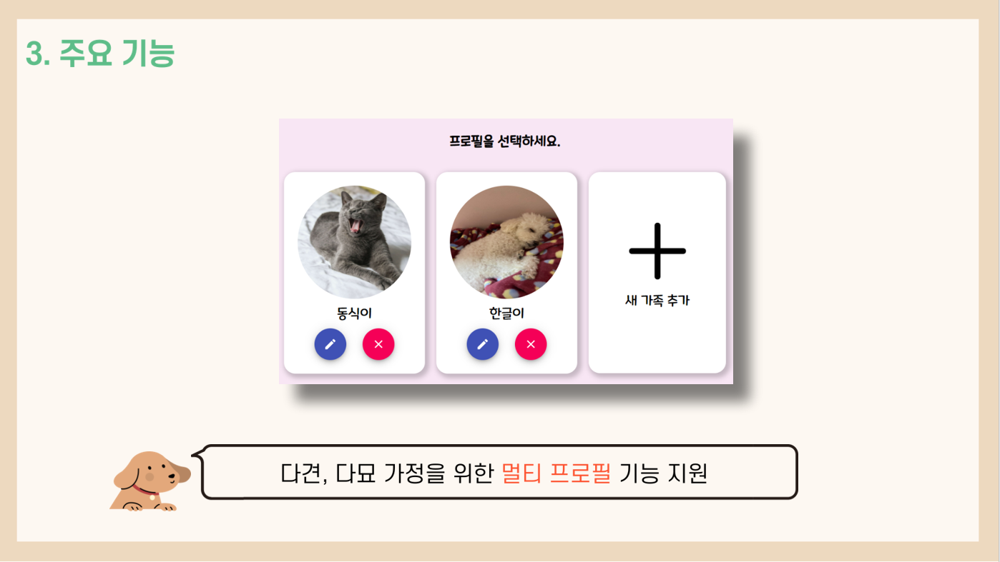

멀티프로필 기능

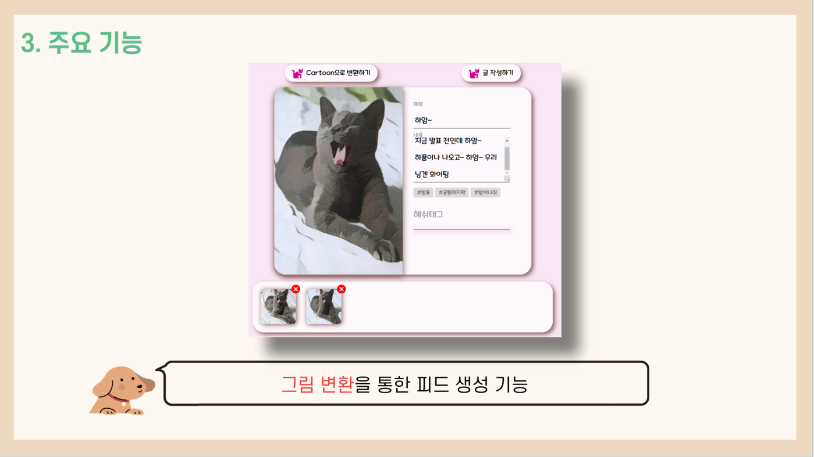

카툰이미지로 변환생성 가능

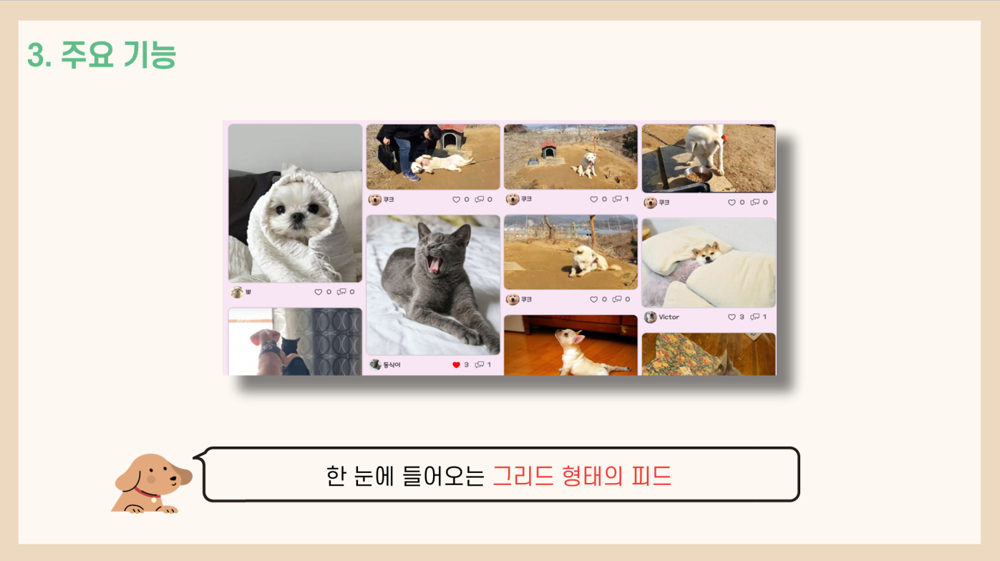

무한스크롤 그리드 형태의 피드

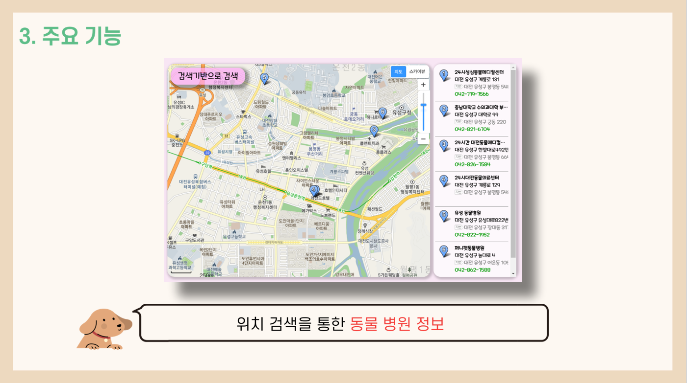

동물병원 지도기반 검색

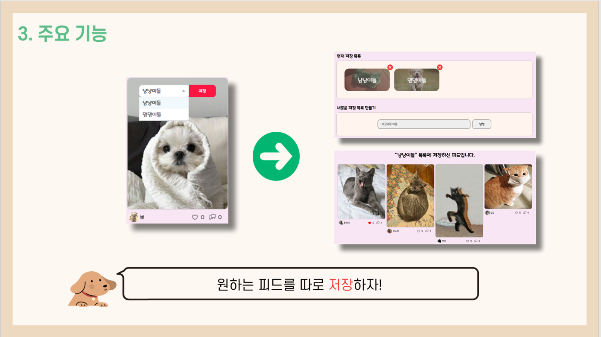

각각의 피드를 내가 원하는 대로 저장할 수 있는 저장소 기능


+ 알람기능
+ 마이프로필 편집
+ 댓글기능
+ 검색기능
+ 해쉬태그기능
+ 인기있는 해쉬태그 검색 기능


# 개발 규칙

## Git

### Commit Message 규약

- #### Git Message Template

  ```bash
  S04P12B204- [feat] : /FE
  # 이슈 번호 [속성] : 내용 /FE 또는 /BE
  ##### 제목은 최대 50 글자까지만 입력 ############## -> |
  -> S04P12B204-90 [feat] : 로그인 기능 /FE
  
  ######## 본문은 한 줄에 최대 72 글자까지만 입력 ########################### -> |
  -> 로그인 시 썸네일 선택해서 해당 프로필로 로그인
  
  #   속성 분류
  #   feat       : 새로운 기능 추가
  #   fix        : 버그 수정
  #   refactor   : 코드 리팩토링
  #   style      : 코드 포맷팅, 세미콜론 누락, 코드 변경이 없는 경우
  #   docs       : 문서 수정
  #   test       : 테스트 코드, 리팩토링 테스트 코드 추가
  #   chore      : 빌드 업무 수정, 패키지 매니저 수정
  # ------------------
  #     제목 첫 글자를 대문자로
  #     제목은 명령문으로
  #     제목 끝에 마침표(.) 금지
  #     제목과 본문을 한 줄 띄워 분리하기
  #     본문은 "어떻게" 보다 "무엇을", "왜"를 설명한다.
  #     본문에 여러줄의 메시지를 작성할 땐 "-"로 구분
  # ------------------
  ```

  - 저장 시 ^M 오류 해결

    1. 적용할 파일을 vim 으로 열기

    2. 명령 모드에서 아래의 명령어 입력

       ```
       :set ff=unix
       ```

       CRLF 값을 LF로 바꿔주며, 이후에 작성한 결과도 LF 값으로 작성이 된다.

  - 템플릿 활용한 깃 메세지 예시

    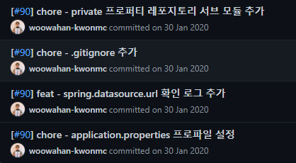

<br>

- #### Commit Message Naming

  >  이슈 번호 [속성] : 내용 /FE 또는 /BE

  예시)

  > S04P12B204-90 [feat] : 로그인 기능 /FE

### Git Flow 규약

참고 : 

[우아한]: https://woowabros.github.io/experience/2017/10/30/baemin-mobile-git-branch-strategy.html	"우아한 형제들 기술 블로그"

참고 : https://woowabros.github.io/experience/2017/10/30/baemin-mobile-git-branch-strategy.html

#### Branch Naming

- `Backend` : **master → develop → feature(JIRA에픽 name) → JIRA이슈번호_BE**

- `Frontend` : **master → develop → feature(JIRA에픽 name) → JIRA이슈번호_FE**

  - master : 제품으로 출시될 수 있는 브랜치

  - develop : 다음 출시 버전을 개발하는 브랜치

    ```
               (기능이 완성되면 feature를 develop에 merge 시킴)
    ```

  - feature : 기능을 개발하는 브랜치(JIRA 에픽 네임으로 설정 ex)Login)

    ```
               (JIRA 이슈가 해결되면 이슈를 feature에 merge시킴)
    ```

  - JIRA-BE : JIRA에 등록된 이슈 대로 브랜치를 만들어 기능을 만듦

    <br>

#### Merge 규칙

- 작업을 시작하기 전에 **JIRA 이슈를 생성**한다.
  - 이슈는 되도록 하나의 커밋으로 한다.
- 커밋 그래프는 최대한 단순하게 한다.
- 서로 공유하는 브랜치의 커밋 그래프는 함부로 변경하지 않는다.
- **merge 를 하기 전** 적어도 1명의 팀원에게 **코드 리뷰** 후 merge를 시킴
- 자신의 Pull Request는 스스로 merge를 한다.

<br>

#### HOW TO 

##### 1. Branch Fork하기

1. 프로젝트(upstream)에서 fork를 떠서 나의 레포(origin)를 생성한다

2. 나의 레포(origin)에서 나의 컴퓨터(local)에 git clone 을 받는다

3. 로컬에서 upstream을 추가해준다.

   > $ git remote add upstream https://lab.ssafy.com/s04-webmobile2-sub2/s04p12b204.git

   > $ git remote [-](https://lab.ssafy.com/s04-webmobile2-sub2/s04p12b204.git)v 로 확인

   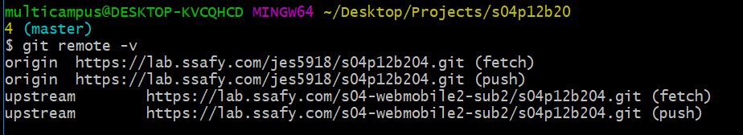

4. 로컬에서 upstream/feature 아래에 지라이슈번호 브랜치를 생성하고 이동한다.

   (track은 upstream/feature를 추적한다.)

   > $ git checkout -b 지라이슈번호--track upstream/feature

<br>

##### 2. Branch 작업하기

1. 해당 브랜치에서 해당 내용을 작업하고 add 한다

   > $ git add .

2. commit 한다(양식에 맞춰서)

   > $ git commit -m “이슈번호 feat : 로그인 기능 추가/BE”

3. 필요하면 rebase로 커밋을 줄인다 아래는 2개 합친 것

   > $ git rebase -i HEAD~2

4. fetch로 최신화 시켜준다

   > $ git fetch --all 로 local을 최신화 시켜준다

5. upstream레포의 해당 브랜치의 최신 작업 내용을 땡겨서 rebase한다.

   > $ git pull --rebase upstream feature

6. origin레포로 push 한다.

   > $ git push origin 작업브랜치

<br>

##### 3. Branch 머지하기

1. Fork뜬 나의 origin 브랜치를 upstream 브랜치에 merge하는 Pull Request를 생성합니다.

2. 같은 feature를 개발하는 동료에게 리뷰 승인을 받은 후 자신의 Pull Request를 merge합니다. 

   만약 혼자 feature를 개발한다면 1~2명의 동료에게 리뷰 승인을 받은 후, Pull Request를 merge합니다.

<br>

##### Option (작업 중 최신화)

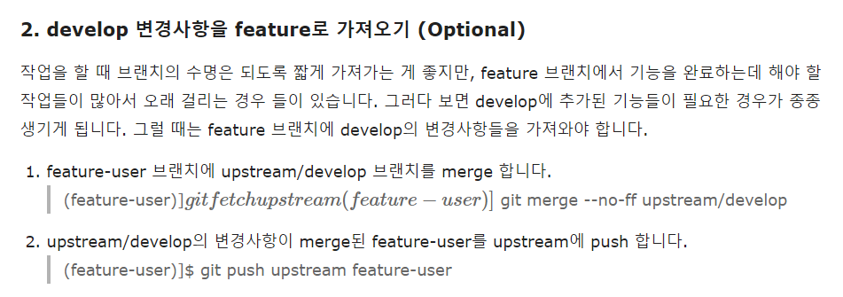

---


# Frontend 

	## 	1. Convention Rules

> Following naver convention rules


1. 네임스페이스, 오브젝트, 함수 그리고 인스턴스에는 camelCase를 사용한다

```
const thisIsMyObject = {};
function thisIsMyFunction() {}
```

2. 클래스나 constructor에는 PascalCase 를 사용한다. eslint: [new-cap](http://eslint.org/docs/rules/new-cap.html)

```
// good
class User {
  constructor(options) {
    this.name = options.name;
  }
}

const good = new User({
  name: "yup",
});
```

3. 약어 및 이니셜은 항상 모두 대문자이거나 모두 소문자이어야 한다.

```
// good
import SMSContainer from "./containers/SMSContainer";

// good
const HTTPRequests = [
  // ...
];

// best
import TextMessageContainer from "./containers/TextMessageContainer";

// best
const Requests = [
  // ...
];
```

3. 클래스명과 변수명은 `명사 사용`을 준수한다.

4. 메서드명은 `동사 사용`을 준수한다.

5. 상수명은 대문자를 사용하고, 단어와 단어사이는 _로 연결한다.

6. 무명함수를 전달하는 듯한)함수식을 이용하는 경우 arrow함수 표기를 이용해 주십시오.

>  왜? arrow함수는 그 context의 `this` 에서 실행하는 버전의 함수를 작성합니다. 이것은 통상 기대대로의 동작을 하고, 보다 간결한 구문이기 때문입니다.

7. 함수의 본체가 하나의 식으로 구성된 경우에는 중괄호({})를 생략하고 암시적 return을 이용하는것이 가능합니다. 그 외에는 return 문을 이용해 주십시오.

```
// good
[1, 2, 3].map(number => `A string containing the ${number}.`);

// bad
[1, 2, 3].map(number => {
  const nextNumber = number + 1;
  `A string containing the ${nextNumber}.`;
});

// good
[1, 2, 3].map(number => {
  const nextNumber = number + 1;
  return `A string containing the ${nextNumber}.`;
});
```

8. 함수의 인수가 하나인 경우 소괄호()를 생략하는게 가능합니다.

```
// good
[1, 2, 3].map(x => x * x);

// good
[1, 2, 3].reduce((y, x) => x + y);
```

9. 우선 `const` 를 그룹화하고 다음에 `let` 을 그룹화 해주십시오.

> 왜? 이전에 할당한 변수에 대해 나중에 새 변수를 추가하는 경우에 유용하기 때문입니다.

```
// bad
let i, len, dragonball,
    items = getItems(),
    goSportsTeam = true;

// bad
let i;
const items = getItems();
let dragonball;
const goSportsTeam = true;
let len;

// good
const goSportsTeam = true;
const items = getItems();
let dragonball;
let i;
let length;
```

