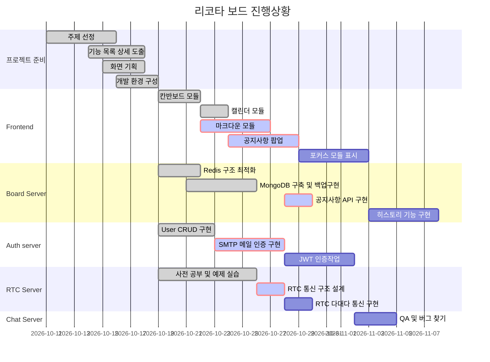

```mermaid
gantt
    dateFormat  MM-DD
    title       리코타 보드 진행상황
    %% excludes    weekends
    %% (`excludes` accepts specific dates in YYYY-MM-DD format, days of the week ("sunday") or "weekends", but not the word "weekdays".)

    section 프로젝트 준비
    주제 선정				  :done, 10-11, 5d
    기능 목록 상세 도출			:done, 10-14, 4d
    화면 기획				  :done, 10-15, 3d
    개발 환경 구성             :done, 10-16, 3d
	
	section Frontend
    칸반보드 모듈		  	:done, kanban, 10-19, 3d
    캘린더 모듈	      	 :done, calendar, after kanban, 2d
    마크다운 모듈 	 	 :crit, active, 10-22,5d
    공지사항 팝업		 	 :crit, active, front1, after calendar, 5d
    포커스 모듈 표시   	  :front2, after front1, 5d
    
    section Board Server
    Redis 구조 최적화 	:done, 10-19, 3d
    MongoDB 구축 및 백업구현     	 :done, 10-21, 5d
    공지사항 API 구현     	 :crit, active, 10-28, 2d
    히스토리 기능 구현		:after front2, 5d
    
    section Auth server
    User CRUD 구현 		   :done, 10-19, 4d
    SMTP 메일 인증 구현       :crit, active, smtp, 10-23, 5d
    JWT 인증작업             :after smtp, 5d

    section RTC Server
    사전 공부 및 예제 실습               :done, rtc1, 10-19, 7d
    RTC 통신 구조 설계				 :crit, active, rtc2, after rtc1, 2d
    RTC 다대다 통신 구현				 :after rtc2, 2d

    section Chat Server
    QA 및 버그 찾기               :11-02, 3d
    
    %%section 기타
    %%UCC제작 :11-23, 3d
    %%발표준비 :11-26, 2d
```